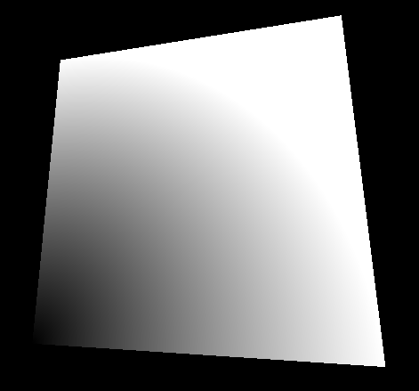

Create the following pattern below using vUv inside fragment.glsl.

Since the pattern is glayscale float strength variable to hold vUv variable you will use, and spread it using vec3() inside vec4(). 

(Hint: use length().)

