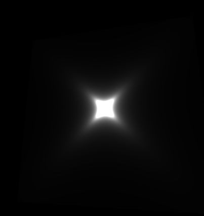

Create the following pattern below using vUv inside fragment.glsl.

Since the pattern is glayscale float strength variable to hold vUv variable you will use, and spread it using vec3() inside vec4(). 

Use rotate function.
```
vec2 rotate(vec2 uv, float rotation, vec2 mid) {
    return vec2(
      cos(rotation) * (uv.x - mid.x) + sin(rotation) * (uv.y - mid.y) + mid.x,
      cos(rotation) * (uv.y - mid.y) - sin(rotation) * (uv.x - mid.x) + mid.y
    );
}
```

And define pi at the top.
#define PI 3.1415926535897932384626433832795

